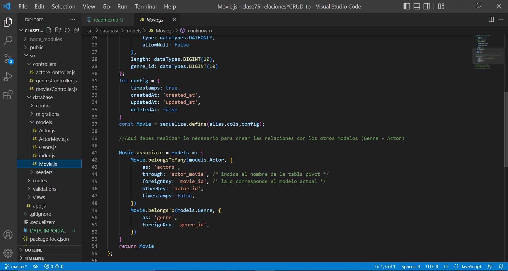

### Relaciones y CRUD
#### En MySQL para unir las tablas y traer los datos relacionales, tenemos los JOINS. Pero en Sequelize esa unión se lleva a cabo de otra manera. 
#### Algunas de las relaciones más conocidas, son de uno a muchos, de muchos a muchos... esto nos permite unir las tablas de la base de datos para luego traer los datos usando la asociación. 
#### Para esto tenemos que tener nuestros modelos ya creados y a partir de allí, crear las relaciones dependiendo de la lógica de negocio. 

